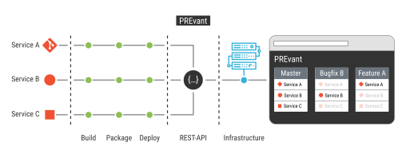

[](https://hub.docker.com/r/aixigo/prevant)
[](./LICENSE)

# PREvant In a Nutshell

PREvant a is Docker container that serves as an abstraction layer between continuous integration pipelines and a container orchestration platform. This abstraction serves as a reviewing platform to ensure that developers have built the features that domain expert requested.

PREvant's name originates from this requirement: _Preview servant (PREvant, `prɪˈvɛnt`, it's pronounced like prevent)_ __serves__ developers to deploy previews of their application as simple as possible when their application consists of multiple microservices distributed across multiple source code repositories. These previews should __PREvant__ to do mistakes in feature development because domain experts can review changes as soon as possible.



Through PREvant's web interface domain experts, managers, developers, and sales experts can review and demonstrate the application development.


## Basic Terminology

An *application*, that PREvant manages, is a composition of microservices based
on an “architectural pattern that arranges an application as a collection of
loosely coupled, fine-grained services, communicating through lightweight
protocols.” ([Wikipedia][wiki-microservices]) Each application has a unique
name which is the key to perform actions like creating, duplicating, modifying,
or deleting these applications via REST API or Web UI.

In each application, PREvant manages the microservices as *services* which need
to be available in the [OCI Image Format][oci-image-spec] (a.k.a. Docker
images). At least one service needs to be available for an application. PREvant
manages the following kind of services:

- *Instance*: a service labeled as instance is a service that has been
  configured explicitly when creating or updating an application.
- *Replica*: a service labeled as replica is a service that has been replicated
  from another application. By default if you create an application under any
  name PREvant will replicate all instances from the application *master*.
  Alternatively, any other application can be specified as a source of
  replication.

Additionally, PREvant provides a way of creating service everytime it creates
an application. These services are called *companions* and there are two types
of them.

- An application wide companion (app companion) is an unique service for the
  whole application. For example, a [Kafka][kafka] instance can be started
  automatically everytime you create an application so that all services within
  the application can synchronize via events.
- A companion can also be attached to a service a user wants to deploy (service
  companion). For example, a [PostgreSQL][postgres] container can be started
  for each service to provide a dedicated database for it.

# Usage

Have a look at the examples directory. There you can find examples that deploy PREvant in different container environments:

- [Docker](examples/Docker/README.md)
- [Kubernetes](examples/Kubernetes/README.md) (requires at least Kubernetes 1.15)

If you want to customize PREvant's behaviour, you can mount a TOML file into the container at the path `/app/config.toml`. You will find more information about the configuration [here](api/README.md).

# Requirements for Your Services

PREvant is able to show the version of your service (build time, version string, and git commit hash) and also to integrate your API specification into the frontend through [Swagger UI](https://swagger.io/tools/swagger-ui/). In order to show the information, PREvant tries to resolve it by using the web-based protocol proposed by [RFC 6415](https://tools.ietf.org/html/rfc6415).

When you request the list of apps and services running through the frontend, PREvant makes a request for each service to the URL `.well-known/host-meta.json` and expects that the resource provides a [host-meta document](http://docs.oasis-open.org/xri/xrd/v1.0/xrd-1.0.html) serialized as JSON:

```json
{
  "properties": {
    "https://schema.org/softwareVersion": "0.9",
    "https://schema.org/dateModified": "2019-04-09T15:31:01.363+0200",
    "https://git-scm.com/docs/git-commit": "43de4c6edf3c7ed93cdf8983f1ea7d73115176cc"
  },
  "links": [
    {
      "rel": "https://github.com/OAI/OpenAPI-Specification",
      "href": "https://example.com/master/service-name/swagger.json"
    }
  ]
}
```

This sample document contains the relevant information displayed in the frontend (each information is optional):

- The software version of the service (see `https://schema.org/softwareVersion`)
- The build time of the service (see `https://schema.org/dateModified`)
- The git commit id of the service (see `https://git-scm.com/docs/git-commit`)
- The link to the API specification (see `https://github.com/OAI/OpenAPI-Specification`)

In order to generate the correct link the API specification PREvant adds following headers to each of these requests:

- [`Forwarded` header](https://developer.mozilla.org/en-US/docs/Web/HTTP/Headers/Forwarded) with `host` and `proto`.
- `X-Forwarded-Prefix` (used by some reverse proxies, cf. [Traefik](https://docs.traefik.io/basics/) and [Zuul](https://cloud.spring.io/spring-cloud-static/Finchley.SR1/multi/multi__router_and_filter_zuul.html)).

# Development

See [development](Develop.md)

# Further Readings

PREvant's concept has been published in the [Joint Post-proceedings of the First and Second International Conference on Microservices (Microservices 2017/2019): PREvant (Preview Servant): Composing Microservices into Reviewable and Testable Applications](http://dx.doi.org/10.4230/OASIcs.Microservices.2017-2019.5).
This paper is based on [the abstract](https://www.conf-micro.services/2019/papers/Microservices_2019_paper_14.pdf) that has been published at the conference [_Microservices 2019_ in Dortmund](https://www.conf-micro.services/2019/).

The talk is available on [YouTube](http://www.youtube.com/watch?v=O9GxapQR5bk). Click on the image to start the playback:

[](http://www.youtube.com/watch?v=O9GxapQR5bk)

[wiki-microservices]: https://en.wikipedia.org/wiki/Microservices
[oci-image-spec]: https://specs.opencontainers.org/image-spec/
[kafka]: https://kafka.apache.org
[postgres]: https://www.postgresql.org
