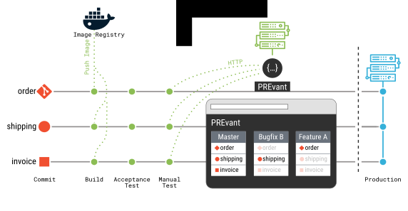

# PREvant In a Nutshell

PREvant is a web-based software tool that acts as a testing and review platform,
simplifying the deployment and management of microservices for development
teams. Operating as a Docker container, it connects continuous integration
pipelines with container orchestration platforms, allowing developers to ensure that
features align with domain expert requirements. PREvant's RESTful API helps to
integrate microservices from different branches (in multi-repo development
setups) into reviewable applications, creating preview environments for testing
new features before they are finalized. This reduces the complexity and speeds
up the development process, aligning with agile methodologies.

The name PREvant short for _Preview servant_, pronounced like "prevent"
(`prɪˈvɛnt`), reflects its role in preventing development errors by enabling
early reviews through its web interface, where stakeholders can assess and give
feedback on application developments efficiently.

Through PREvant's web interface domain experts, managers, developers, and sales
experts can review and demonstrate the application development.

For a more in-depth look at PREvant, check out the detailed explanation in the
research paper that can be viewed [here in the Further Readings'
section](README.md#further-readings).

> This paper introduces PREvant (preview servant), a software tool which
> provides a simple RESTful API for deploying and composing containerized
> microservices as reviewable applications. PREvant’s API serves as a connector
> between continuous delivery pipelines of microservices and the infrastructure
> that hosts the applications. Based on the REST API and a web interface
> developers and domain experts at aixigo AG developed quality assurance
> workflows that help to increase and maintain high microservice quality [Joint
> Post-proceedings of the First and Second International Conference on
> Microservices (Microservices 2017/2019): PREvant (Preview Servant): Composing
> Microservices into Reviewable and Testable
> Applications](http://dx.doi.org/10.4230/OASIcs.Microservices.2017-2019.5).

## Basic Terminology

An *application*, that PREvant manages, is a composition of microservices based
on an “architectural pattern that arranges an application as a collection of
loosely coupled, fine-grained services, communicating through lightweight
protocols.”  ([Wikipedia][wiki-microservices]) Each application has a unique
name which is the key to perform actions like creating, duplicating, modifying,
or deleting these applications via REST API or Web UI.

> Figure [above] illustrates the disjoint repositories and continuous delivery
> pipelines of the microservices order, shipping, and invoice. The build stage
> packages the microservices as a container image and pushes it to a container
> image registry (e.g. a Docker registry) to ensure that the services are ready
> for deployment in the acceptance and manual test stages. In a deployment phase,
> such as the manual test stage depicted in [above] Figure, the continuous
> delivery pipeline can utilize PREvant’s REST API. This REST request creates a
> software-defined network, initiates the container for the microservice, connects
> it to the network, and creates a reverse-proxy configuration, making the service
> accessible through PREvant’s web interface. Subsequent REST calls check whether
> the container image has a newer version, and if so, then the container is
> updated [Joint Post-proceedings of the First and Second International Conference
> on Microservices (Microservices 2017/2019): PREvant (Preview Servant): Composing
> Microservices into Reviewable and Testable
> Applications](http://dx.doi.org/10.4230/OASIcs.Microservices.2017-2019.5).

In each application, PREvant manages the microservices as *services* which need
to be available in the [OCI Image Format][oci-image-spec] (a.k.a. Docker
images). At least one service needs to be available for an application. PREvant
manages the following kind of services:

- *Instance*: a service labeled as instance is a service that has been
  configured explicitly when creating or updating an application.
- *Replica*: a service labeled as replica is a service that has been replicated
  from another application. By default if you create an application under any name
  PREvant will replicate all instances from the application *master*.
  Alternatively, any other application can be specified as a source of
  replication.

## Companions

Additionally, PREvant provides a way of deploying services every time it creates
an application. These services are called *companions* and there are two types
of them.

- Application wide companion (short app companion): is a unique service for the
  entire application. For example, a [Kafka][kafka] instance can be started
  automatically every time an application is created, so that all services
  within the application can synchronize via events.
- Service companion:  A companion can also be attached to a specific service a
  user wants to deploy. For example, a [PostgreSQL][postgres] container can be
  started for each service to provide it with a dedicated database.

Further instructions to configure Companions can be seen
[here](docs/companions.md).

# Usage

In this section, you'll find examples of deploying PREvant in container environments:

- For Docker, refer to [Docker example](examples/Docker/README.md)
- For Kubernetes (requires at least Kubernetes 1.15), refer to [Kubernetes example](examples/Kubernetes/README.md)

To customize the behavior of PREvant, you can mount a TOML file into the container at `/app/config.toml`. More details about the configuration can be found [here](docs/configuration.md).

# Integration of Your Services into the dashboard

As shown above in the screenshot, PREvant offers some integration into its
dashboard. How the integration can be achieved is documented
[here](docs/web-host-meta.md).

# Where can I find the release version?

The official release of PREvant is available as OCI/Docker image on
[hub.docker.com](https://hub.docker.com/r/aixigo/prevant). There is only the
`latest` tag because this projects aims to take backwards compatibility to a
extreme: any future change must be backwards compatibility and this considers:

1. The HTTP API documented in the PREvant OpenAPI documentation.
2. Any configuration (TOML file, CLI flags & environment variables prefixed
   with `PREVANT_`) will stay backwards compatibility and any new configuration
   parameter will either have no effect or provides a sane default.
3. Support the currently maintained Docker & Kubernetes APIs. PREvant will use
   the recent crates/libraries calling out to these API versions that are in
   maintenance and thus support for unmaintained API version may drop without
   any notice.

# Development

In the [Development](docs/Develop.md) section, you can view the detailed guide on,
how to develop/run PREvant.

Developers looking to contribute to PREvant can engage through GitHub by
addressing issues, enhancing documentation, and submitting pull requests. The
project's open-source nature encourages collaboration and innovation from the
developer community.

# Further Readings

PREvant's concept has been published in the [Joint Post-proceedings of the First and Second International Conference on Microservices (Microservices 2017/2019): PREvant (Preview Servant): Composing Microservices into Reviewable and Testable Applications](http://dx.doi.org/10.4230/OASIcs.Microservices.2017-2019.5).
This paper is based on [the abstract](https://www.conf-micro.services/2019/papers/Microservices_2019_paper_14.pdf) that has been published at the conference [_Microservices 2019_ in Dortmund](https://www.conf-micro.services/2019/).

The talk delivered at the conference is available on [YouTube](http://www.youtube.com/watch?v=O9GxapQR5bk). Click on the image to start the playback:

[wiki-microservices]: https://en.wikipedia.org/wiki/Microservices
[oci-image-spec]: https://specs.opencontainers.org/image-spec/
[kafka]: https://kafka.apache.org
[postgres]: https://www.postgresql.org
