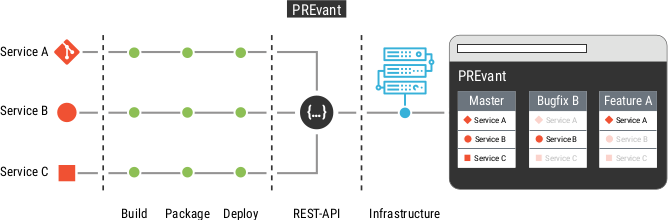

# PREvant In a Nutshell

PREvant is a small set of docker containers that serves as an abstraction layer between continuous integration pipelines and some container orchestration platform. This abstraction serves as a reviewing platform to ensure that developers have built the features that domain expert requested. 

PREvant's name originates from this requirement: _Preview servant (PREvant)_ __serves__ developers to deploy previews of their application as simple as possible when their application consists of multiple microservices distributed across multiple source code repositories. These previews should __PREvant__ and help developers to do mistakes in their feature development because domain experts can review changes as soon as possible.

# Disclaimer :warning:

This project is currently being made available as open source. Not all features are already available yet.

