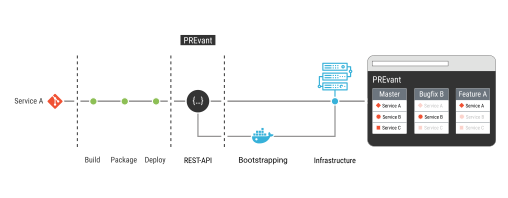

# Companion Configuration

Have a look at the [basic terminology](../README.md) to understand what a
companion is. For these use cases the following sections provide example
configurations.

A simple, but limited configuration of companions can be done via the
`config.toml` file for [application companions](#application-wide) and [service
companions](#service-based). More complex companions can be created via
[bootstrapping](#bootstrapping-from-the-infrastructure-backend).

## Static Configuration

### Application Wide

If you want to include an OpenID provider for every application, you could use
the following configuration:

```toml
[companions.openid]
type = 'application'
image = 'private.example.com/library/openid:latest'
env = [ 'KEY=VALUE' ]
```

The provided values of `serviceName` and `env` can include the [handlebars syntax][handlebars] in order to access dynamic values.

Additionally, you could mount files that are generated from handlebars templates (example contains a properties generation):

```toml
[companions.openid.volumes]
"/path/to/volume.properties" = """
remote.services={{#each services~}}
  {{~#if (eq type 'instance')~}}
    {{name}}:{{port}},
  {{~/if~}}
{{~/each~}}
"""
```

Furthermore, you can provide labels through handlebars templating:

```toml
[companions.openid.labels]
"com.github.prevant" = "bar-{{application.name}}"
```

#### Routing

If you need to customize the routing behaviour of companions you can adjust it
for companions. For example, [Adminer](https://hub.docker.com/_/adminer) needs
some adjustments to accept logins running behind a reverse proxy (which is
Traefik).

```toml
[companions.adminer]
type = 'application'
image = 'adminer:4.8.1'

[companions.adminer.routing.additionalMiddlewares]
headers = { 'customRequestHeaders' = { 'X-Forwarded-Prefix' =  '/{{application.name}}/adminer' } }
```

In addition, you can overwrite the whole routing of the companion. For example,
if you want to make the Adminer available under
`/{{application.name}}/adminer/sub-path/` you can provide following
configuration.

```toml
[companions.adminer]
type = 'application'
image = 'adminer:4.8.1'

[companions.adminer.routing]
rule = 'PathPrefix(`/{{application.name}}/adminer/sub-path`)'

[companions.adminer.routing.additionalMiddlewares]
headers = { 'customRequestHeaders' = { 'X-Forwarded-Prefix' =  '/{{application.name}}/adminer/sub-path' } }
stripPrefix = { 'prefixes' = [ '/{{application.name}}/adminer/sub-path' ] }
```

Please, note that PREvant in the latter case does not set the [StripPrefix
Middleware](https://doc.traefik.io/traefik/middlewares/http/stripprefix/) and
it needs to be recreated.

#### Template Variables

The list of available handlebars variables:

- `application`: The companion's application information
  - `name`: The application name
- `services`: An array of the services of the application. Each element has the
  following structure:
  - `name`: The service name which is equivalent to the network alias
  - `port`: The exposed port of the service
  - `type`: The type of service. For example, `instance`, `replica`, `app-companion`, or `service-companion`.

#### Handlebar Helpers

PREvant provides some handlebars helpers which can be used to generate more complex configuration files. See handlerbar's [block helper documentation](https://handlebarsjs.com/block_helpers.html) for more details.

- `{{#isCompanion <type>}}` A conditional handlerbars block helper that checks if the given service type matches any companion type.
- `isNotCompanion <type>` A conditional handlerbars block helper that checks if the given service type does not match any companion type.

### Service Based

The service-based companions work the in the same way as the application-based
services. Make sure, that the `serviceName` is unique by using handlebars
templating.

```toml
[companions.service-name]
serviceName = '{{service.name}}-db'
image = 'postgres:11'
env = [ 'KEY=VALUE' ]

[companions.service-name.postgres.volumes]
"/path/to/volume.properties" == "…"
[companions.openid.labels]
"com.github.prevant" = "bar-{{application.name}}"
```


#### Template Variables

The list of available handlebars variables:

- `application`: The companion's application information
  - `name`: The application name
- `service`: The companion's service containing the following fields:
  - `name`: The service name which is equivalent to the network alias
  - `port`: The exposed port of the service
  - `type`: The type of service. For example, `instance`, `replica`, `app-companion`, or `service-companion`.

### Deployment Strategy

Companions offer different deployment strategies so that a companion could be restarted or not under certain conditions. Therefore, PREvant offers following configuration flags:

```toml
[companions.openid]
type = 'application'
image = 'private.example.com/library/openid:latest'
deploymentStrategy = 'redeploy-on-image-update'
```

`deploymentStrategy` offers the following values and if a companion exists for an app following strategy will be applied:

- `redeploy-always` (_default_): Re-deploys the companion every time there is a new deployment request.
- `redeploy-on-image-update`: Re-deploys the companion if there is a more rescent image available.
- `redeploy-never`: Even if there is a new deployment request the companion won't be redeployed and stays running.

### Storage Strategy

Companions may have varying storage requirements and storage strategies cater to these by offering the below configuration flags:

```toml
[companions.postgres]
type = 'application'
image = 'postgres:latest'
storageStrategy = 'mount-declared-image-volumes'
```

`storageStrategy` offers the following values to determine how storage is managed for a companion:

- `none` (_default_): Companion is deployed without persistent storage.
- `mount-declared-image-volumes`: Mounts the volume paths declared within the image, providing persistent storage for the companion.

## Bootstrapping From the Infrastructure Backend

When the [static configuration](#static-configuration) is insufficient for your
use case, then PREvant can utilize the underlying infrastructure to bootstrap
the companion configuration from the stdout of containers that are run once
within the infrastructure (depicted by the following image). PREvant's static
companion configuration might be insufficient if services of the application
rely on volume sharing among services (see [#123][persistent-data-issue]) or
when operations are required to be run at the application's start up, e.g.
importing test data.



In the depicted images PREvant will start one or more containers on the
infrastructure backend that are expected to generate output on standard out
(stdout) that will be parsed by PREvant that needs to be native to the
underlying infrastructure.

- When PREvant uses Kubernetes as the infrastructure runtime, the bootstrap
  containers need to output [Kubernetes manifests][k8s-manifest].

  Make sure to output YAML that is compatible with 1.1 and 1.2
  (For example, bitnami helm charts have been adjusted in part in that regard,
  see [here][zookeeper-yaml-1.2-pr] and [here][kafka-yaml-1.2-pr])
- Docker: not yet implemented but the aim is to support [Docker
  compose][docker-compose] files.

Then before deploying these bootstrapped companions PREvant merges them with
the objects generated from the HTTP request payload (all bootstrapped
companions will be considered as application companions). Thus you can add or
overwrite configurations. For example, you can change the image used or an
environment variable. If you overwrite any configuration the companion will be
turned into an instance (as PREvant did previously).

The following configuration block depicts that an image
`registry.example.com/user/bootstrap-helm-chart:lastet` is based on a [Helm
chart][helm-chart] that generates an OpenID provider for your application with
[Keycloak][keycloak]. Additionally, it is possible to pass additional arguments
to the container than can be templated with [Handlebars][handlebars].

```toml
[[companions.bootstrapping.containers]]
image = "registry.example.com/user/bootstrap-helm-chart:latest"
args = [
   "--set", "keycloak.httpRelativePath=/{{application.name}}/keycloak/",
   "--set", "keycloak.redirectUris[0]={{application.baseUrl}}oauth_redir"
]
```

The list of available handlebars variables for bootstrap container arguments:

- `application`: The companion's application information
  - `name`: The application name
  - `baseUrl`: The URL that all services in the application share
- `infrastructure`: Holds information that are specific to the underlying
  infrastructure.
  - 'namespace' (Kubernetes): the name of the namespace where the application
    will be installed in.

[docker-compose]: https://docs.docker.com/compose/
[handlebars]: https://handlebarsjs.com/
[helm-chart]: https://helm.sh/docs/topics/charts/
[k8s-manifest]: https://kubernetes.io/docs/reference/glossary/?all=true#term-manifest
[keycloak]: https://www.keycloak.org/
[persistent-data-issue]: https://github.com/aixigo/PREvant/issues/123
[zookeeper-yaml-1.2-pr]: https://github.com/bitnami/charts/pull/21081
[kafka-yaml-1.2-pr]: https://github.com/bitnami/charts/pull/21086
