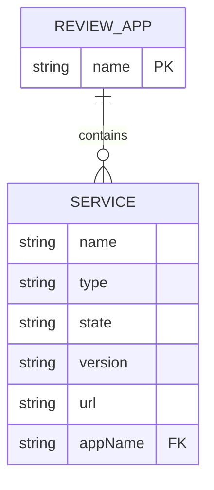
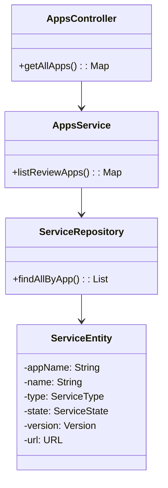
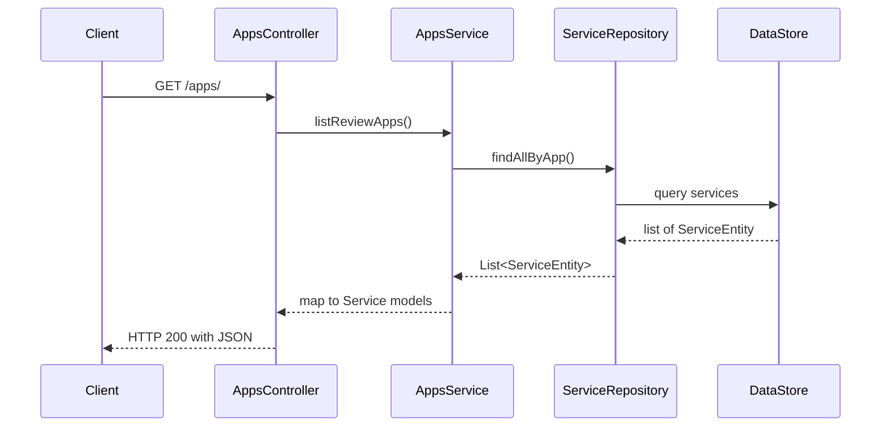

<!--
  Detailed spec for the "List Deployed Review Apps" feature.
-->
# List Deployed Review Apps

Endpoint: GET `/apps/`

Purpose: Retrieve the current status of all review applications deployed on the PREvant instance.

## 1. Overview

This endpoint returns a mapping of review application names to their service details. It enables:
- Monitoring the state and URL of each service in a review app.
- Displaying a live dashboard of active preview environments.
- Automating alerts and cleanup based on service status.

## 2. Request

No parameters.

```
GET /apps/ HTTP/1.1
Host: api.prevant.example.com
Accept: application/json
```

## 3. Response

### 200 OK

JSON object where each key is an application name and each value is a Service object:

```json
{
  "my-app": {
    "name": "db",
    "type": "instance",
    "state": "running",
    "version": "1.0.0",
    "url": "http://prevant.example.com/my-app/db"
  },
  "another-app": {
    "name": "wordpress",
    "type": "replica",
    "state": "pending",
    "version": "5.7",
    "url": "http://prevant.example.com/another-app/blog"
  }
}
```

### 500 Internal Server Error

```json
{
  "type": "about:blank",
  "title": "Internal Server Error",
  "status": 500,
  "detail": "Unexpected error while retrieving apps"
}
```

## 4. Data Model

Service schema (see openapi):

```yaml
Service:
  type: object
  properties:
    name: string
    type: [instance, replica, app-companion, service-companion]
    state: string
    version: string
    url: string (url)
```

## 5. Diagrams

### Entity–Relationship Diagram (ERD)



### Class Diagram



### Sequence Diagram




*See also:* Shutdown Review App, Start or Update Review App