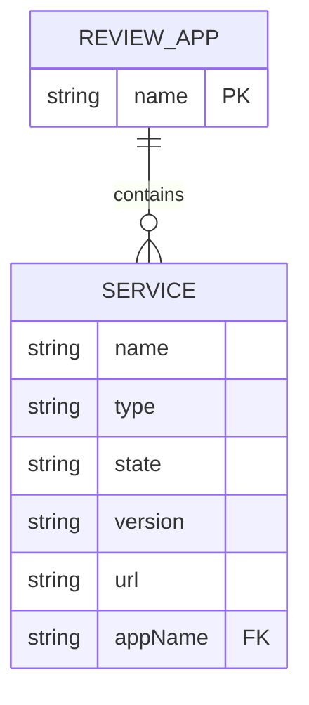
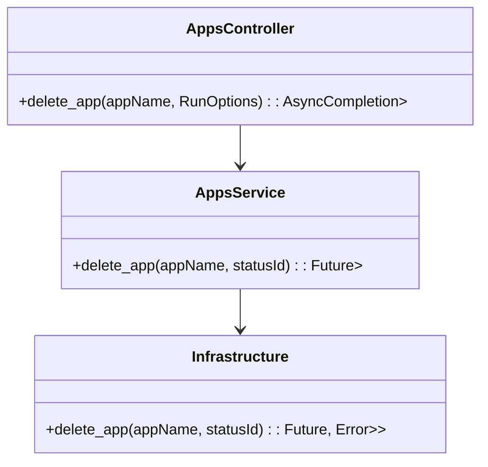
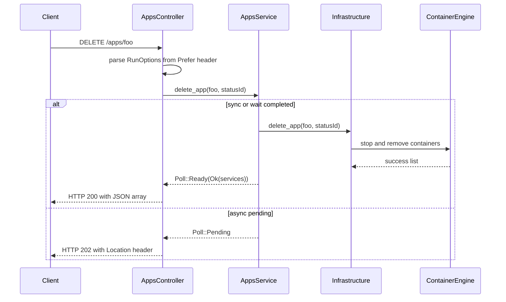

<!--
  Detailed spec for the "Shutdown Review App" feature.
-->
# Shutdown Review App

**Endpoint:** DELETE `/apps/{appName}`
**Header Parameter:** `Prefer: respond-async[,wait=<seconds>]`

**Purpose:** Stop and remove all containers associated with the specified review application.

## 1. Overview

This endpoint allows clients to terminate a review application identified by `appName`. Clients can choose synchronous or asynchronous execution via the `Prefer` header. After the operation, remaining container states are returned or can be polled.

## 2. Request

### 2.1 Path Parameter
- `appName` (string, required): Name of the review application to shut down.

### 2.2 Header Parameter: Prefer
Based on [RFC-7240]:
- `Prefer: respond-async` — return immediately with HTTP 202 Accepted.
- `Prefer: respond-async,wait=<seconds>` — wait up to `<seconds>` before responding.

### 2.3 Request Body
None.

## 3. Response

| Status | Description                                                       | Body                                    |
|--------|-------------------------------------------------------------------|-----------------------------------------|
| 200    | Synchronous shutdown completed.                                   | JSON array of `Service` objects         |
| 202    | Shutdown queued for asynchronous processing.                      | *empty* (use `Location` header to poll) |
| 409    | Conflict: application is currently deploying or deleting.         | `ProblemDetails`                        |
| 500    | Internal server error.                                           | `ProblemDetails`                        |

**Location Header** (202): `/api/apps/{appName}/status-changes/{statusId}`

## 4. Data Models

- **Service**: Represents a container/service and its final state (see OpenAPI).
- **AppStatusChangeId**: Identifier for polling async status changes.

## 5. Diagrams

### 5.1 Entity–Relationship Diagram (ERD)

### 5.2 Class Diagram

### 5.3 Sequence Diagram

*See also:* [List Deployed Review Apps](list-deployed-review-apps.md), [Start or Update Review App](start-or-update-review-app.md)