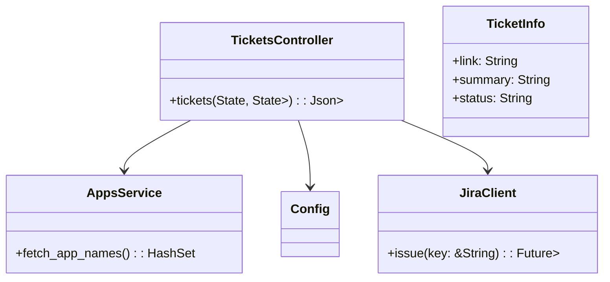
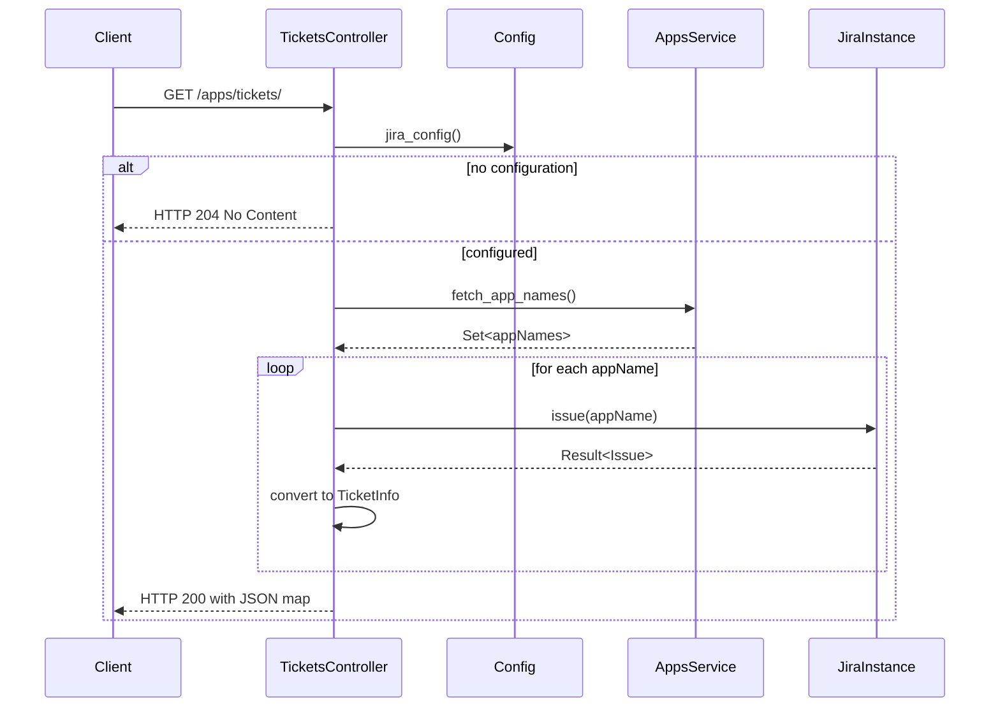

<!--
  Detailed spec for the "Get Ticket Information" feature.
-->
# Get Ticket Information

**Endpoint:** GET `/apps/tickets/`
**Purpose:** Retrieve issue tracker metadata for each deployed review application.

## 1. Overview

The ticket information endpoint integrates with an external issue tracker (e.g., Jira) to attach ticket links, summaries, and statuses to review apps. It:
- Fetches all review app names.
- Queries the ticket system for each app name.
- Returns a mapping of app name to `TicketInfo`.

If no issue-tracking configuration is present, the endpoint responds with HTTP 204 No Content.

## 2. Request

No parameters. Example:
```http
GET /apps/tickets/ HTTP/1.1
Host: api.prevant.example.com
Accept: application/json
```

## 3. Response

| Status | Description                                                | Body                                        |
|--------|------------------------------------------------------------|---------------------------------------------|
| 200    | Success. One entry per review app with ticket metadata.    | JSON object: `{ [appName: string]: Ticket }`|
| 204    | No issue tracking configured.                              | *empty*                                     |
| 500    | Unexpected error querying the ticket system.               | `ProblemDetails` (error details)            |

### 3.1 200 OK Example
```json
{
  "my-app": {
    "link": "https://jira.example.com/browse/MY-1",
    "summary": "Add user authentication",
    "status": "In Review"
  },
  "another-app": {
    "link": "https://jira.example.com/browse/AN-42",
    "summary": "Fix database migration",
    "status": "Closed"
  }
}
```

## 4. Data Model

`TicketInfo` fields (see OpenAPI spec at `#/components/schemas/Ticket`):
```yaml
Ticket:
  type: object
  properties:
    link:
      type: string
      format: uri
    summary:
      type: string
    status:
      type: string
```

## 5. Diagrams

### 5.1 Class Diagram


### 5.2 Sequence Diagram



*See also:* [List Deployed Review Apps](list-deployed-review-apps.md)