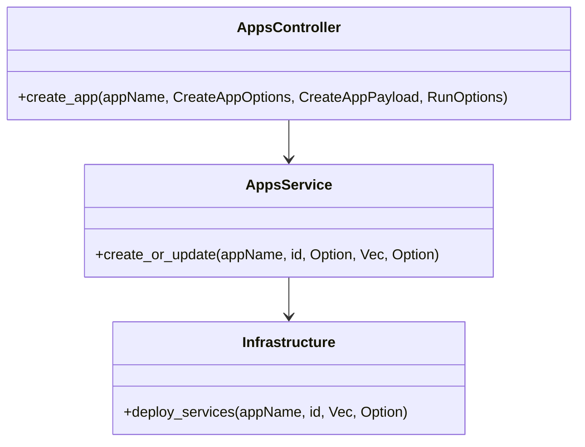

<!--
  Detailed spec for the "Start or Update Review App" feature.
-->
# Start or Update Review App

**Endpoint:** POST `/apps/{appName}`
**Query Parameter:** `replicateFrom` (default `master`)
**Header Parameter:** `Prefer: respond-async[,wait=<seconds>]`

**Purpose:** Create or update a review application by deploying a set of services, with optional cloning and custom parameters.

## 1. Overview

A review application is a temporary preview environment composed of multiple containerized services. This endpoint enables:
- Provisioning or updating an app identified by `appName`.
- Cloning service configs and parameters from an existing app (`replicateFrom`).
- Choosing synchronous vs asynchronous execution via the Prefer header.
- Supplying service definitions and user-defined payload.

## 2. Request Structure

### 2.1 Path Parameter
- `appName` (string, required): Name of the review application.

### 2.2 Query Parameter
- `replicateFrom` (string, optional): Source app to clone. Default: `master`.

### 2.3 Header Parameter: Prefer
Based on [RFC-7240]:
- `Prefer: respond-async` — return immediately (202 Accepted).
- `Prefer: respond-async,wait=<seconds>` — wait up to `<seconds>` before returning.

### 2.4 Request Body
Content-Type: `application/json`. Two variants:

**Variant A**: JSON array of `ServiceConfiguration`:
```json
[
  { /* ServiceConfiguration */ },
  { /* ... */ }
]
```

**Variant B**: JSON object with `services` and optional `userDefined`:
```json
{
  "services": [ /* ServiceConfiguration items */ ],
  "userDefined": { /* arbitrary JSON for custom schema */ }
}
```

Each `ServiceConfiguration` fields:

| Field       | Type                    | Description                                                             | Required |
|-------------|-------------------------|-------------------------------------------------------------------------|----------|
| serviceName | string                  | Logical name (e.g. `db`, `web`).                                        | yes      |
| image       | string                  | Docker image (`[registry/]repo[:tag]`).                                 | yes      |
| env         | object or array         | Environment variables (key=value strings or objects).                  | no       |
| files       | object                  | Files to create in container (`path`: `content`).                       | no       |

Deprecated: `volumes` alias is supported but superseded by `files`.

#### EnvironmentConfiguration
`env` can be:
- Array of strings: `"KEY=VALUE"` pairs.
- Object: map of keys to `EnvironmentValue`.

`EnvironmentValue` (object):

| Field     | Type    | Description                                            | Default |
|-----------|---------|--------------------------------------------------------|---------|
| value     | string  | Environment variable value.                            | n/a     |
| replicate | boolean | Clone this value if `replicateFrom` is used.           | false   |
| templated | boolean | Treat as template (e.g. mustache) when rendering URLs. | false   |

Example:
```json
{
  "MARIADB_PASSWORD": {"value":"secret","replicate":true},
  "DEBUG": "true"
}
```

### userDefined
Optional JSON payload validated against the [user-defined schema](../user-defined-schema.md).

## 3. Response

| Status | Description                                                              | Body                               |
|--------|--------------------------------------------------------------------------|------------------------------------|
| 200    | Synchronous deployment succeeded.                                         | JSON array of `Service` objects    |
| 202    | Deployment accepted (async). Check `Location` header for status URL.     | *empty*                            |
| 409    | Conflict: app is already deploying or deleting.                           | `ProblemDetails`                   |
| 500    | Internal server error.                                                   | `ProblemDetails`                   |

**Location Header** (202): `/api/apps/{appName}/status-changes/{statusId}`

## 4. Data Models

See OpenAPI spec:
- `ServiceConfiguration`: definition of requested services.
- `Service`: representation of deployed services.

## 5. Diagrams

### 5.1 ERD
```mermaid
erDiagram
    REVIEW_APP ||--o{ SERVICE_CONFIG : includes
    REVIEW_APP {
      string name PK
      string replicateFrom
      string statusChangeId
    }
    SERVICE_CONFIG {
      string serviceName
      string image
      object? files
      object? env
      string appName FK
    }
```

### 5.2 Class Diagram


### 5.3 Sequence Diagram
```mermaid
sequenceDiagram
    Client->>Controller: POST /apps/foo?replicateFrom=bar
    Controller->>PayloadParser: FromData<CreateAppPayload>
    Controller->>Controller: extract CreateAppOptions and RunOptions
    Controller->>AppsService: create_or_update(foo, id, Some(bar), services, userDefined)
    alt sync or wait completed
        AppsService->>Infrastructure: deploy_services
        Infrastructure->>Docker/K8s: start services
        ...
        AppsService-->>Controller: Poll::Ready(Ok(services))
        Controller-->>Client: 200 with JSON
    else async pending
        AppsService-->>Controller: Poll::Pending
        Controller-->>Client: 202 with Location
    end
```


*See also:* [List Deployed Review Apps](list-deployed-review-apps.md), [Shutdown Review App](shutdown-review-app.md)